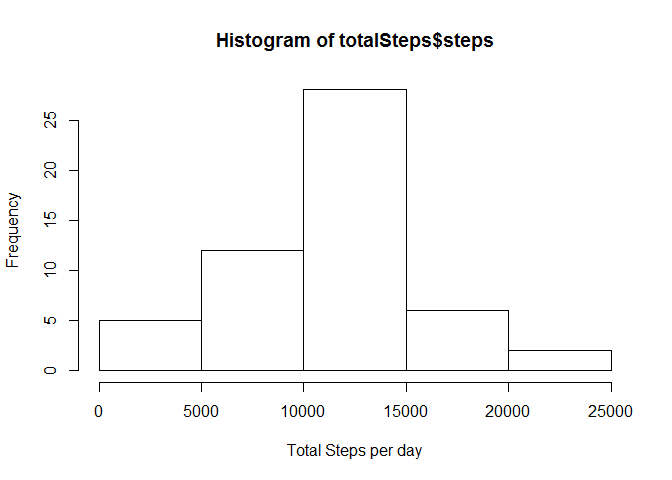
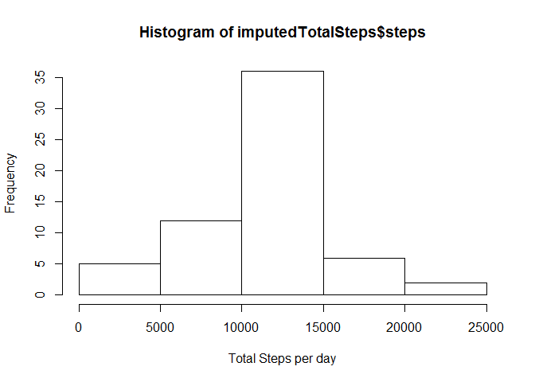

# Reproducible Research: Peer Assessment 1

## Loading and preprocessing the data

Unzip and load current data

```r
unzip("activity.zip")
activity <- read.csv("activity.csv")
```


## What is mean total number of steps taken per day?

Calculate total steps per day and look at distribution.

```r
totalSteps<-aggregate(steps~date,data=activity, FUN = sum,na.rm=TRUE)
hist(totalSteps$steps, xlab = "Total Steps per day")
```

 

Calculate mean and median of total steps

```r
mean(totalSteps$steps)
```

```
## [1] 10766.19
```

```r
median(totalSteps$steps)
```

```
## [1] 10765
```


## What is the average daily activity pattern?

Calculate mean steps per 5 min interval and plot time series.


```r
stepsInterval <- aggregate(steps ~ interval, data = activity, FUN = mean, na.rm = TRUE)
plot(steps ~ interval, data = stepsInterval, type = "l")
```

 

Which 5-minute interval, on average across all the days in the dataset, contains the maximum number of steps? (Starting at min #:)

```r
maxInterval <- stepsInterval[which.max(stepsInterval$steps),"interval"]
maxInterval
```

```
## [1] 835
```


## Imputing missing values

Number of missing values:


```r
sum(is.na(activity))
```

```
## [1] 2304
```

Replace NAs with mean steps for that interval over all days.


```r
imputedActivity <- activity
imputedActivity$steps <- 
  ifelse(is.na(imputedActivity$steps),
        stepsInterval$steps[match(imputedActivity$interval,stepsInterval$interval)],
        imputedActivity$steps)
```
Calculate total steps per day of imputed data and look at distribution.

```r
imputedTotalSteps<-aggregate(steps~date,data=imputedActivity, FUN = sum,na.rm=TRUE)
hist(imputedTotalSteps$steps, xlab = "Total Steps per day")
```

 

Calculate mean and median of total steps

```r
mean(imputedTotalSteps$steps)
```

```
## [1] 10766.19
```

```r
median(imputedTotalSteps$steps)
```

```
## [1] 10766.19
```

## Are there differences in activity patterns between weekdays and weekends?
